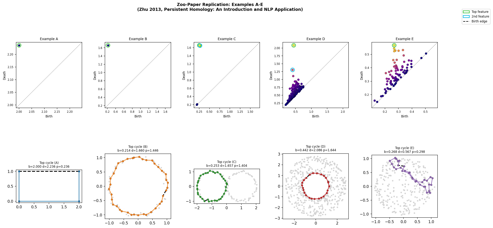

# giotto-tda-cycles

**Representative H₁ cycle visualisation for [giotto-tda](https://github.com/giotto-ai/giotto-tda) / [gph-ripser](https://github.com/giotto-ai/giotto-ph)**

`giotto-tda` computes persistent homology barcodes beautifully.  
What it does **not** give you is a way to look at the actual loops — the
geometric paths through your point cloud that correspond to each H₁ bar.

This add-on fills that gap.

---

## What it does

`gph.ripser_parallel(return_generators=True)` returns four integers per H₁
bar: the birth edge `(u, v)` and the death triangle.  Those integers are not
a cycle — they are just the simplex that *created* the homological class.
To get a drawable loop you need a second step.

`RepresentativeCycles` provides that step: it builds the Vietoris-Rips
1-skeleton at the birth radius, runs **scipy's C-level Dijkstra** from `u`
to `v` (excluding the birth edge so the path is forced around the hole), and
closes the loop with the birth edge.  The result is a valid representative of
the H₁ class — a closed edge-path you can actually plot.

```python
from representative_cycles import RepresentativeCycles
import numpy as np

theta = np.linspace(0, 2 * np.pi, 80, endpoint=False)
X = np.column_stack([np.cos(theta), np.sin(theta)])

rc = RepresentativeCycles(min_persistence=0.2)
rc.fit(X)
rc.summary()
rc.plot_matplotlib(save_path="output/circle.png")
rc.plot_plotly().show()
```

---

## Example output

The figure below replicates examples A–E from Zhu (2013)
*"Persistent Homology: An Introduction and a New Text Representation for NLP"*,
the same paper whose barcodes were originally produced by JavaPlex.
All five expected topologies are recovered correctly.



| Example | Shape | Expected β₁ | Observed β₁ |
|---------|-------|:-----------:|:-----------:|
| A | Rectangle (exact Zhu §2.3 example) | 1 | 1 ✓ |
| B | Circle S¹ | 1 | 1 ✓ |
| C | Figure-eight S¹∨S¹ | 2 | 2 ✓ |
| D | Torus T² (H₁(T²) = ℤ×ℤ) | 2 | 2 ✓ |
| E | Sphere S² (H₁ = 0) | 0 | 0 ✓ |

Example A is verifiable to floating-point precision: birth = **2.000000**,
death = **√5 ≈ 2.236068**, exactly matching the Zhu §2.3 prediction.

---

## Installation

```bash
pip install gph-ripser giotto-tda scipy scikit-learn matplotlib plotly
# then clone / copy representative_cycles.py into your project
```

Or install all dependencies at once:

```bash
pip install -r requirements.txt
```

---

## Usage

### Point cloud (Euclidean)

```python
rc = RepresentativeCycles(
    min_persistence=0.1,   # ignore short-lived noise bars
    max_edge_length=2.0,   # cap filtration for speed
    metric="euclidean",    # default
)
rc.fit(X)                  # X: (n_points, n_dims)
rc.summary()               # print birth/death/persistence table
rc.plot_matplotlib()       # static figure: persistence diagram + cycle panels
rc.plot_barcode()          # barcode sorted by persistence
rc.plot_plotly()           # interactive, toggleable cycles
```

### Pre-computed distance matrix

Any metric space — cosine similarity on text, geodesic distances on meshes,
correlation matrices, etc.:

```python
from scipy.spatial.distance import pdist, squareform

D = squareform(pdist(X, metric="cosine"))

rc = RepresentativeCycles(metric="precomputed")
rc.fit(D)      # D: (n_points, n_points) symmetric, zeros on diagonal
rc.summary()
rc.plot_matplotlib()   # visualises MDS embedding of D
```

### Accessing cycle data directly

```python
for feature in rc.features_:
    print(feature.birth, feature.death, feature.persistence)
    print("birth edge:", feature.birth_edge)
    print("cycle edges:", feature.cycle_edges)   # (n_edges, 2) int array
    print("cycle vertices:", feature.cycle_vertices)
```

---

## API reference

### `RepresentativeCycles(min_persistence, max_edge_length, metric, coeff, n_threads, reconstruct_cycles)`

| Parameter | Default | Description |
|-----------|---------|-------------|
| `min_persistence` | `0.0` | Drop features below this persistence threshold |
| `max_edge_length` | `np.inf` | Cap on the Rips filtration (speeds up large inputs) |
| `metric` | `'euclidean'` | `'euclidean'` for point clouds; `'precomputed'` for distance matrices |
| `coeff` | `2` | Coefficient field — use 2 for Z/2Z |
| `n_threads` | `1` | Threads passed to `ripser_parallel` |
| `reconstruct_cycles` | `True` | Set `False` to skip cycle reconstruction (barcode only) |

### `.fit(X)` → `self`

Runs Vietoris-Rips persistent homology and reconstructs cycles.

### `.features_`  →  `list[CycleFeature]`

Sorted by persistence descending.  Each `CycleFeature` has:
`index`, `birth`, `death`, `persistence`, `birth_edge`, `death_edge`,
`cycle_edges` (shape `(n_edges, 2)`), `cycle_vertices`.

### `.diagrams_`  →  `list[np.ndarray]`

Standard giotto-tda / Ripser persistence diagrams.

---

## How this compares to alternatives

| | **This library** | **JavaPlex** | **GUDHI** |
|---|---|---|---|
| Language | Python | Java / MATLAB | C++ / Python |
| Representative cycles | Shortest-geodesic-path heuristic | Algebraic boundary-matrix reduction | `persistence_generator_extension` |
| Same homology class? | Yes | Yes | Yes |
| Identical cycle edges? | Not necessarily | — | Not necessarily |
| giotto-tda integration | Native (uses `gph-ripser`) | None | Via `gudhi.representations` |
| Interactive visualisation | Plotly + matplotlib | None built-in | None built-in |
| Pre-computed distance matrices | Yes (`metric='precomputed'`) | Yes | Yes |

**Cycle representative note:**  
JavaPlex and GUDHI compute cycle representatives via algebraic boundary-matrix
reduction — the canonical pivot-column representative.  This library uses a
shortest-geodesic-path heuristic: the output is a *valid* representative of
the same homology class, but the specific edges may differ.  The heuristic
tends to produce geometrically tighter (visually cleaner) loops.

**float32 note:**  
`gph-ripser` requires float32 inputs.  Coordinates are cast to float32 only
for the `ripser_parallel` call; all distance computations for cycle
reconstruction run in float64 to preserve accuracy.

---

## Running the examples

```bash
# five canonical examples (circle, figure-eight, torus, annulus, sphere)
python examples.py

# Zhu (2013) zoo-paper replication with pass/fail checks
python zoo_paper_replication.py

# outputs saved to ./output/
```

---

## Project structure

```
representative_cycles.py    core module
examples.py                 gallery of five canonical examples
zoo_paper_replication.py    Zhu (2013) replication with pass/fail checks
requirements.txt
tests/
    test_representative_cycles.py   pytest suite
output/                     generated figures (gitignored by default)
```

---

## References

- Zhu, X. (2013). *Persistent Homology: An Introduction and a New Text
  Representation for Natural Language Processing.*
  IJCAI 2013, pp. 1953–1959.
  [(paper)](https://pages.cs.wisc.edu/~jerryzhu/pub/homology.pdf)
- Tausz, A., Vejdemo-Johansson, M., & Adams, H. (2011). JavaPlex: A research
  software package for persistent (co)homology.
- Edelsbrunner, H., & Harer, J. (2010). *Computational Topology: An
  Introduction.* AMS.
- Bauer, U. (2021). Ripser: efficient computation of Vietoris-Rips persistence
  barcodes. *Journal of Applied and Computational Topology*, 5(3), 391–423.

---

## License

MIT
